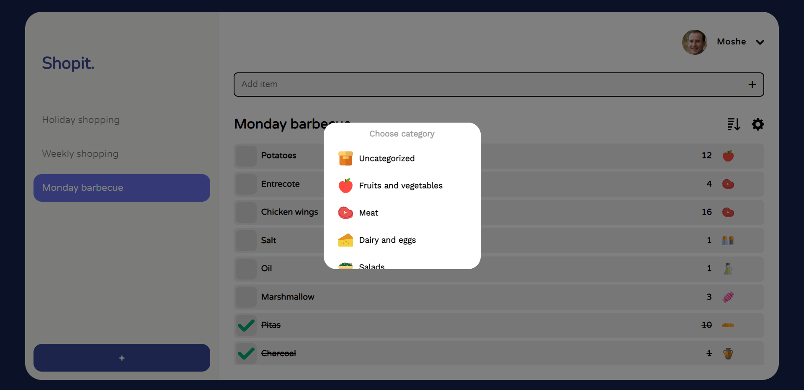

# Shopit

## This repository contains:

- The **[frontend](https://shopit-alfi.students.nomoredomainssbs.ru)** React Application
- Link to the **[Backend API](https://api.shopit-alfi.students.nomoredomainssbs.ru)**

## Project overview

This project is an online personal shopping lists.
where you can add, edit, check and remove items.

- Registration and login users
- Add multiple lists and fill them with items
- Check, edit or delete any item you want
- A lot of items are ordered in categories

## In this project I've specialized in:

- Node.js
- Express.js
- MongoDB
- React
- Adaptive design
- Fetch requests
- Google cloud

## Screenshots

#### Register

#### List

#### Edit item

#### Edit item category

